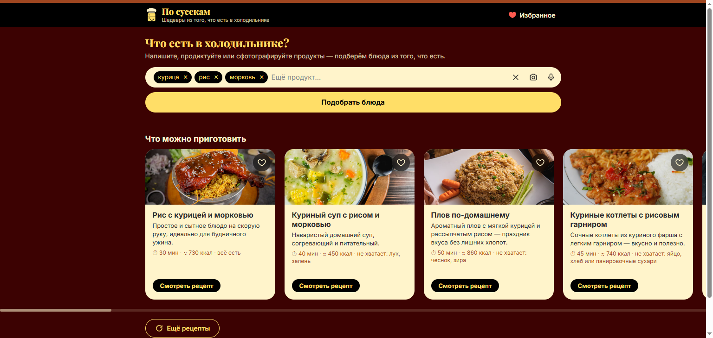
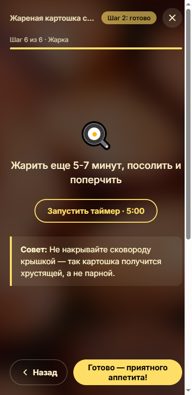

# По сусекам

**Рецепты из того, что есть в холодильнике.** Перечислите продукты текстом, голосом или сфотографируйте полку —
приложение предложит шесть блюд с фото, калориями и пошаговым режимом с таймерами.

**Живая версия:** https://po-susekam.pages.dev



## Что умеет

- **Три способа ввести продукты.** Текст с чипсами (запятая или Enter), фото продуктов (Claude распознаёт,
  что на снимке) и голос. Голос работает во всех браузерах: Web Speech в Chrome, Edge и Safari, а в Firefox
  и Brave — запись в браузере и Whisper на сервере.
- **Шесть блюд на запрос** — от простых до чуть более интересных, с отметкой, чего не хватает. Кнопка
  «Ещё рецепты» даёт ещё шесть, без повторов.
- **Калории на порцию** считает сервер по калорийности каждого ингредиента, а не модель «на глаз».
- **Фото блюд** из Unsplash, запасной источник — Pexels, с подписью автора. Одинаковых снимков у карточек
  не бывает.
- **Пошаговый режим:** один шаг на экран, иконка и таймер определяются по тексту шага, несколько таймеров
  одновременно, звуковой сигнал и вибрация, экран не гаснет.
- **Избранное** в браузере, видео-поиск на YouTube по названию блюда.
- Адаптив от 390 px, вёрстка по макету из Figma.



## Стек

| Часть | Технологии |
|---|---|
| Фронтенд | Vue 3 (Options API), Vue Router, Vite, SCSS |
| Бэкенд | Cloudflare Pages Functions |
| Рецепты и распознавание | Claude API (`claude-sonnet-5`, structured outputs по JSON-схеме) |
| Речь в текст | Whisper `@cf/openai/whisper-large-v3-turbo` на Cloudflare Workers AI |
| Фото | Unsplash API, Pexels API, кэш на сутки в Cloudflare |

## Как устроено

```
Vue 3 + Vite  ── /api/* ──►  Cloudflare Pages Functions  ──►  Claude API
                                                          ──►  Unsplash / Pexels
                                                          ──►  Workers AI (Whisper)
```

| Эндпоинт | Что делает |
|---|---|
| `POST /api/recipes` | `{ ingredients, exclude? }` → 6 рецептов по JSON-схеме, калории на порцию, лимит раундов подбора |
| `POST /api/recognize` | фото (`{ image, mediaType }`) или продиктованная фраза (`{ text }`) → список продуктов |
| `POST /api/transcribe` | аудио (webm / ogg / mp4) → текст через Whisper; на тишине — пустой текст |
| `GET /api/photo?q=` | фото блюда: Unsplash, при отказе — Pexels; ответ кэшируется на сутки |

Ключи API живут только на сервере, в браузер не попадают.

## Запуск локально

Нужны Node.js 20+ и аккаунт Cloudflare (`npx wrangler login`).

1. Создайте в корне файл `.dev.vars` (он в `.gitignore`):
   ```
   ANTHROPIC_API_KEY=...
   UNSPLASH_ACCESS_KEY=...
   PEXELS_API_KEY=...
   ```
2. Установите зависимости и соберите фронт:
   ```
   npm install
   npm run build
   ```
3. В двух терминалах:
   ```
   npm run dev:api   # функции на http://127.0.0.1:8788
   npm run dev       # Vite на http://localhost:5173, /api проксируется на 8788
   ```

Голос локально ходит в настоящий Workers AI вашего аккаунта. Запасной путь записи можно проверить в Chrome,
добавив к адресу `?voice=record`.

## Деплой

```
npx wrangler pages project create po-susekam --production-branch main
npx wrangler pages secret put ANTHROPIC_API_KEY --project-name po-susekam   # и два других ключа
npm run build
npx wrangler pages deploy dist --project-name po-susekam --branch main
```

Binding Workers AI берётся из `wrangler.toml`.

## Лимиты и стоимость

- **Claude:** один подбор — около 1 000 входных и 2 200 выходных токенов (замер по `response.usage`).
- **Whisper на Workers AI:** $0,0005 за минуту аудио; бесплатной суточной квоты хватает примерно
  на 640 диктовок по 20 секунд.
- **Unsplash:** в демо-режиме 50 запросов в час, после одобрения приложения — 1 000 в час бесплатно.
  Pexels — 200 в час. Фото кэшируются на сутки, а подбор ограничен двумя раундами (12 рецептов),
  чтобы не расходовать лимит.

## Проверка качества: evals

Ответы модели проверяются автотестами — [`evals/`](evals). Один и тот же запрос Claude каждый раз решает
немного по-разному, поэтому проверяется не точный текст, а свойства ответа, а результат — доля успешных
запусков. Так правку промпта, effort или модели видно в цифрах, а не «вроде стало лучше».

- **18 кейсов:** обычные холодильники, один продукт и двенадцать, опечатки, английский, несъедобное
  («камни, песок, вода»), несъедобное рядом со съедобным, повторный подбор с `exclude`.
- **13 проверок кодом**, без второй модели: ровно 6 рецептов, калории по каждому ингредиенту, в `missing` нет
  продуктов пользователя, блюда из его продуктов, `image_query` на английском, несъедобное не попадает
  в рецепт, уже показанные блюда не повторяются и другие.
- Кейсы идут через тот же обработчик, что в проде, каждый по 3 раза. Прогон считает токены и стоимость
  и сравнивает результат с прошлым прогоном.

```
npm run eval -- --runs 3               # все кейсы: 54 запроса, ≈ $0,95, ≈ 5 минут
npm run eval -- --only бумага --runs 5 # один кейс
npm run eval -- --rescore              # перепроверить прошлые ответы после правки проверок, без API
```

**Что нашёл первый прогон** (463 из 468 проверок): на «бумага, клей, сыр» модель возвращала пустой ответ
в 5 из 6 запусков — несъедобное рядом со съедобным обнуляло весь подбор. Вручную это не находилось:
проверяли только полностью несъедобный список. После правки промпта:

| Кейс | До | После |
|---|---|---|
| бумага, клей, сыр → рецепты из сыра | 1 из 6 | 5 из 5 |
| камни, яйца → рецепты без камней | 3 из 3 | 3 из 3 |
| камни, песок, вода / гвозди, топор / asdfgh → пустой ответ | 18 из 18 | 9 из 9 |

По замерам прогона один подбор стоит ≈ $0,018 и занимает ≈ 24 секунды (медиана).

**Второй набор — распознавание продуктов** (`/api/recognize`, `--suite recognize`): 12 продиктованных фраз
и 2 фото. Проверяет, что названные продукты не теряются и не выдумываются, количества («полкило», «двести
грамм»), слова-паразиты и марки не попадают в поле, ошибки речи исправляются («марковь» → «морковь»),
а несъедобное (камни, гвозди, цемент на фото) даёт пустой список. Результат — 201 из 201, прогон ≈ $0,04
и минута.

```
npm run eval -- --suite recognize --runs 3
```

## Как сделан

Проект собран с Claude Code по спецификации — она лежит в [`CLAUDE.md`](CLAUDE.md): архитектура, дизайн,
поведение, API, план по этапам и найденные на репетициях грабли. Сборку ведёт собственный скилл: этапы по
порядку, после каждого — сборка, проверка API через curl и самопроверка вёрстки в headless Chrome
(скриншоты и горизонтальный перелив на 1536 и 390 px).

Замеры этого прогона:
- сборка с нуля до работающего прода — **22 минуты**;
- доработка «голос во всех браузерах» с деплоем — **4 минуты**, три автоматических сценария проверки
  (запись, Brave, тишина) пройдены.

План сборки и замеры репетиций — в [`EXAM-PLAYBOOK.pdf`](EXAM-PLAYBOOK.pdf).
